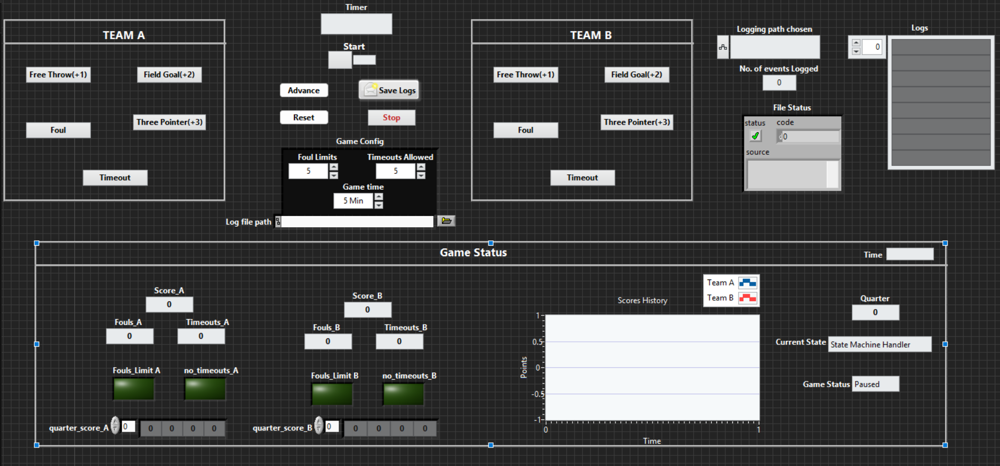

# Basketball Scoreboard (LabVIEW)

A LabVIEW application that simulates a real electronic basketball scoreboard used
in sports arenas. A scorekeeper tracks every game event in real time, points,
fouls, and timeouts for two teams across four quarters, with a running game clock,
live score charting, and automatic logging of every event to a file. I built it
to practice a queue-based producer-consumer architecture in LabVIEW.

## Architecture
The application runs several parallel While loops that communicate through queues,
which keeps the user interface responsive and the scoring logic cleanly separated
from it.

| Loop | Responsibility |
|------|----------------|
| Timer Loop | Runs the game clock on a 100 ms timed loop and the game state machine |
| UI Event Loops | Capture button presses and enqueue command strings (no direct scoring) |
| Score Processing Loop | Dequeues commands, updates scores/fouls/timeouts, drives indicators |
| File Logger Loop | Dequeues log lines and appends them to the game log file |

Two queues connect them: one carries command strings from the UI loops to the
score loop (for example "A_SCORE_2" or "B_FOUL"), and another carries formatted
log lines from the score loop to the logger loop. This producer-consumer split is
the core design pattern of the project.

## Features
- Two-team scoring with 1, 2, and 3-point buttons
- Foul tracking with a foul-limit LED per team
- Timeout tracking with a no-timeouts-remaining LED per team
- Game clock with start/pause and automatic quarter-end handling
- Four-quarter flow with a game-over winner result
- Waveform chart of cumulative score per quarter for both teams
- Configurable game settings loaded from a config file at startup
- Automatic timestamped event logging to a text file
- Clean programmatic shutdown across all loops

## Technical highlights
- Multiple parallel While loops with two queue channels (producer-consumer)
- 2 state machines (game flow and command handler)
- 2 event structures, 2 enum-driven case structures
- 5 SubVIs and 5 strict typedefs (.ctl)
- File read (config) and append-write (event log)
- Programmatic stop via a shared boolean wired to every loop

## Screenshots

**Front panel (scoreboard)**

## Built with
- LabVIEW 2021 (21.0)
- Queues, state machines, and file I/O

## Skills demonstrated
LabVIEW, Producer-Consumer Architecture, Queues, State Machines, Event-Driven Programming, File I/O
